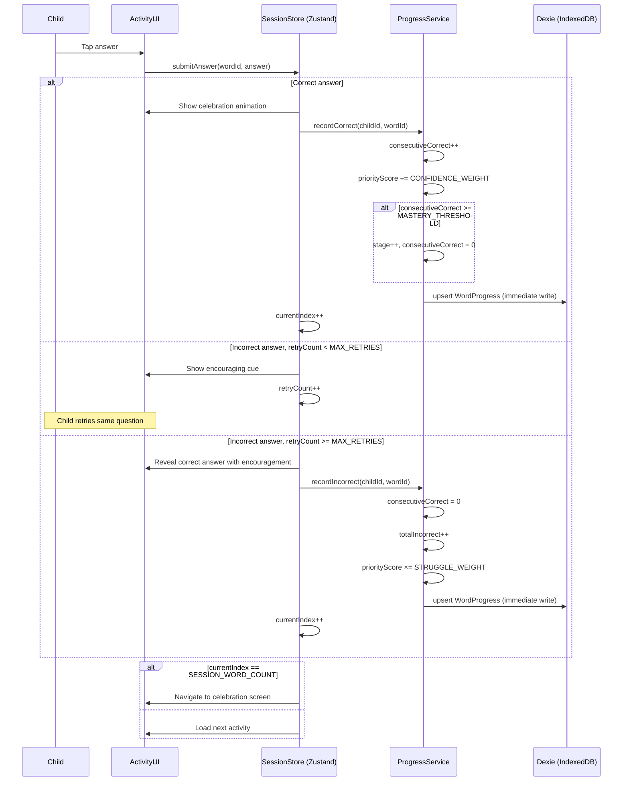

# Feature Specification: Vocabulary Learning

**Feature Branch**: `001-vocab-learning`
**Created**: 2026-05-10
**Status**: Draft
**Input**: User description: "Vocabulary learning for a 6-year-old using Cambridge YLE Starters word sets, with a 4-stage learn-then-test progression"

## User Scenarios & Testing *(mandatory)*

### User Story 1 — Introduce a New Word (Priority: P1)

A 6-year-old child opens the app and starts a vocabulary session. A picture of an object appears
on screen alongside the written word. The child taps the picture or a play button and hears the
word spoken aloud clearly. They can replay the audio as many times as they like. No correct/wrong
judgment is made — this stage is purely passive exposure.

**Why this priority**: Without exposure, no subsequent recall stage is possible. This is the
entry gate to all vocabulary learning.

**Independent Test**: A session containing only Stage 1 (Introduce) words can be started,
played through 10 words, and completed — with audio playing per word and the session ending in a
celebration screen. No scoring or progression is required.

**Acceptance Scenarios**:

1. **Given** a child opens a new thematic word set, **When** they tap any word card, **Then** the word's picture is shown large on screen and the audio pronunciation plays automatically.
2. **Given** audio is playing, **When** the child taps the replay button, **Then** the audio restarts from the beginning.
3. **Given** the child has seen all 10 words in the session, **When** the last word is viewed, **Then** a "Well done!" celebration screen appears and the session is marked complete.

---

### User Story 2 — Recognize a Word by Hearing (Priority: P1)

The child hears a word spoken aloud and must tap the correct picture from a grid of 4 options.
All 4 images are shown simultaneously. After the child taps, immediate feedback is given — a
cheerful animation for correct, a gentle "try again" cue for incorrect. Incorrect answers allow
one retry on the same question before the system moves on with encouragement.

**Why this priority**: Recognition (hearing → image) is the first active recall stage and
unlocks the mastery progression system.

**Independent Test**: A session containing only Stage 2 (Recognize) words can be played through
10 questions end-to-end, receiving feedback on each, and reaching the celebration screen.

**Acceptance Scenarios**:

1. **Given** a Recognize question loads, **When** the screen appears, **Then** the word's audio plays automatically and 4 picture options are shown in a 2×2 grid.
2. **Given** the child taps the correct picture, **When** the answer registers, **Then** a celebration animation plays and the mascot reacts positively before advancing.
3. **Given** the child taps an incorrect picture, **When** the answer registers, **Then** a gentle encouraging cue is shown (never a negative sound or red X), the wrong option is visually distinguished, and the child may try once more.
4. **Given** the child taps incorrectly a second time, **When** the second attempt registers, **Then** the correct answer is highlighted with encouragement and the session advances.

---

### User Story 3 — Unscramble the Word (Priority: P2)

The child sees a picture of the word. Below the picture, scrambled letter tiles are displayed.
The child drags or taps tiles to arrange them into the correct spelling. When all tiles are
placed in the right order, a celebration plays. If the order is wrong after submission, the tiles
gently reset with an encouraging cue and the child tries again (up to 2 retries before the answer
is revealed).

**Why this priority**: Unscramble introduces active spelling recall without requiring fine motor
keyboard skills, making it appropriate for a 6-year-old.

**Independent Test**: A session of 10 Unscramble activities can be completed end-to-end,
including tile interaction, feedback animations, and session celebration.

**Acceptance Scenarios**:

1. **Given** an Unscramble question loads, **When** the screen appears, **Then** the picture is shown prominently and letter tiles appear scrambled in a random order below.
2. **Given** the child arranges all tiles into the correct word, **When** the last tile is placed, **Then** the word is automatically checked and a celebration plays immediately.
3. **Given** the arrangement is incorrect after the child submits, **When** feedback appears, **Then** tiles gently animate back to scrambled position and an encouraging mascot cue plays.
4. **Given** the child fails twice, **When** the second retry is exhausted, **Then** the correct word snaps into place with an encouraging mascot message and the session advances.

---

### User Story 4 — Fill in the Missing Letter (Priority: P2)

The child sees a picture and the word with one letter replaced by a blank. Below, 3 letter
choices are shown as large tappable buttons. The child taps the correct letter. Feedback and
retry logic match the Recognize stage (one retry, then reveal with encouragement).

**Why this priority**: This stage completes the difficulty progression from passive to full
active spelling, closing the learning loop before mastery is declared.

**Independent Test**: A session of 10 Fill-in-blank activities can be played through completely,
including letter selection, feedback, and session celebration.

**Acceptance Scenarios**:

1. **Given** a Fill-in-blank question loads, **When** the screen appears, **Then** the picture is shown, the partial word is displayed with a clearly marked blank, and 3 letter buttons are shown.
2. **Given** the child taps the correct letter, **When** the answer registers, **Then** the blank fills in with the letter, a celebration animation plays, and the session advances.
3. **Given** the child taps an incorrect letter, **When** the answer registers, **Then** a gentle encouraging cue plays and the child may try once more.
4. **Given** the child taps incorrectly a second time, **Then** the correct letter fills in with encouragement and the session advances.

---

### User Story 5 — Mastery Progression & Session Composition (Priority: P1)

The system tracks each word's stage and struggle history per child profile. Sessions are composed
using a spaced repetition model: words the child struggles with appear more frequently in upcoming
sessions, while confidently mastered words are spaced further apart. A session of 10 words is
composed by prioritizing struggling words first, then stage-appropriate words, then new unstarted
words from the same WordSet at Stage 1. Each incorrect answer is recorded as a struggle event and
increases the word's review priority for the next session. A word advances to the next stage only after the child answers it correctly
`MASTERY_THRESHOLD` consecutive times at its current stage. Once a word completes Stage 4 with
mastery, it is marked "learned" and earns a visual star on the child's word map.

**Why this priority**: Without progression tracking, there is no learning system — only
disconnected mini-games. This is the connective tissue of the feature.

**Independent Test**: Given a child profile with known word stages, the session composer
correctly mixes stage-appropriate words and correct answers increment the mastery counter while
incorrect answers reset it.

**Acceptance Scenarios**:

1. **Given** a child has 6 words at Stage 1 and 4 words at Stage 3, **When** a session starts, **Then** the session contains those 10 words presented in their respective stage activities.
2. **Given** a child has only 3 words in progress within a WordSet and a session needs 10, **When** the session is composed, **Then** the remaining 7 slots are filled with the next unstarted words from the same WordSet at Stage 1.
3. **Given** a child answered a word incorrectly in a previous session, **When** the next session is composed, **Then** that struggling word appears in the session at a higher priority than non-struggling words at the same stage.
4. **Given** a child has consistently answered a word correctly across multiple sessions, **When** the session is composed, **Then** that word's review interval is longer and it occupies a slot less frequently than struggling words.
2. **Given** a word is at Stage 2 and the child answers it correctly `MASTERY_THRESHOLD` times across sessions, **When** the threshold is reached, **Then** the word advances to Stage 3.
3. **Given** a child answers a word incorrectly, **When** the answer is recorded, **Then** the consecutive-correct counter for that word resets to zero (stage does not regress).
4. **Given** a word completes Stage 4 with mastery, **When** the session ends, **Then** a star appears on that word's card on the WordSet's word map screen.
5. **Given** a child opens a WordSet, **When** the word map loads, **Then** only that WordSet's words are shown — not words from other sets.

---

### Edge Cases

- What happens if the child exits mid-session? Progress for completed words in that session is saved; the incomplete session restarts from the beginning next time.
- What happens if the audio file for a word fails to load? A visual speaker icon with "tap to retry" is shown; the activity must still be completable without audio.
- What happens if all words in a set are fully learned (Stage 4 mastered)? The word set shows a "Completed!" badge and offers a "Review All" mode replaying Stage 3–4 activities.
- What if a thematic set has fewer than 10 total words? The session uses all available words in that set; no cross-set padding.

## Interaction Sequences

### Answer Submission Flow

## Requirements *(mandatory)*

### Functional Requirements

- **FR-001**: The system MUST present vocabulary from Cambridge YLE Starters thematic word sets (e.g., Animals, Food, Clothes, Colors, Body, Toys, Family).
- **FR-002**: Each word MUST have an associated picture and an audio pronunciation.
- **FR-003**: The system MUST support 4 distinct activity stages per word: Introduce, Recognize, Unscramble, Fill-in-blank.
- **FR-003a**: The WordSet detail screen MUST display one session-entry button per activity stage (Introduce / Recognize / Unscramble / Fill-in-blank). Each button starts a spaced-repetition session composed by the existing session composer, filtered to words eligible at that stage.
- **FR-003b**: Stage buttons 2–4 MUST be locked until at least `STAGE_UNLOCK_THRESHOLD` (default 50%) of the WordSet's words have been mastered at the preceding stage. Tapping a locked button MUST trigger a shake/bounce animation on the locked button and a simultaneous pulse/bounce on the prerequisite stage button to guide the child. No negative sound or text is shown.
- **FR-004**: A word MUST NOT advance to the next stage until the child answers correctly `MASTERY_THRESHOLD` consecutive times at the current stage.
- **FR-005**: Each session MUST contain exactly `SESSION_WORD_COUNT` words. `MAX_SESSION_MINUTES` is a soft target — sessions MAY slightly exceed it for Stage 3–4 heavy loads without being considered a failure.
- **FR-005a**: When a WordSet has fewer in-progress words than `SESSION_WORD_COUNT`, remaining slots MUST be filled with the next unstarted words from the same WordSet at Stage 1 (Introduce).
- **FR-006**: The system MUST compose each session using a spaced repetition priority model: (1) struggling words due for review, (2) stage-appropriate words by review interval, (3) new unstarted words from the same WordSet at Stage 1.
- **FR-006a**: The system MUST record every incorrect answer as a struggle event against the specific word in the active child's profile.
- **FR-006b**: Each word MUST maintain a numeric priority score in `WordProgress`. Incorrect answers MUST multiply the score by `STRUGGLE_WEIGHT`; correct answers MUST divide the score by `CONFIDENCE_WEIGHT`. The session composer MUST fill slots by selecting the highest-priority eligible words first.
- **FR-007**: Every correct answer MUST trigger an immediate celebration animation and positive mascot reaction.
- **FR-008**: Every incorrect answer MUST trigger a gentle encouraging response — no negative sounds, red crosses, or shame-inducing feedback.
- **FR-009**: Incorrect answers MUST allow exactly `MAX_RETRIES` retry before the correct answer is revealed with encouragement.
- **FR-010**: The Unscramble activity MUST use draggable/tappable letter tiles — no free keyboard text input.
- **FR-011**: The Fill-in-blank activity MUST present exactly `LETTER_CHOICE_COUNT` letter buttons — no free keyboard text input.
- **FR-012**: A child's mastery stage per word MUST be persisted across sessions. `WordProgress` MUST be written to local storage after each individual answer (not batched at session end), so that mid-session exits do not lose answered-word progress. A `WordProgress` record MUST be created lazily — only when the word first appears in a session; no pre-seeding at profile creation or WordSet open.
- **FR-013**: Each WordSet MUST display its own word map showing all words in the set. Words fully mastered (Stage 4 complete) MUST be marked with a visible star on that WordSet's map.
- **FR-014**: Audio for all word pronunciations MUST be available offline after first load.
- **FR-015**: The system MUST surface a child-friendly offline/error state if audio cannot load — the activity MUST remain completable without audio.
- **FR-016**: A parent or teacher MUST be able to toggle audio on or off from a settings panel accessible from the home screen.
- **FR-017**: On app launch, the system MUST display a profile picker showing each child profile as a large avatar image with the child's name. Tapping a profile MUST read the name aloud and enter that child's session.
- **FR-018**: The parent/teacher dashboard MUST display, per child per word: total sessions practiced, total incorrect attempts, and current mastery stage — enabling visibility into individual struggle patterns.

### Key Entities

- **WordSet**: A named thematic group (e.g., "Animals") containing a list of Words.
- **Word**: A vocabulary entry with picture asset reference, audio asset reference, and display text.
- **WordProgress**: Tracks a child's current stage (1–4), consecutive-correct count, total incorrect count, and a floating-point priority score for a specific Word. Priority score starts at `INITIAL_PRIORITY`; incorrect answers multiply it by `STRUGGLE_WEIGHT`; correct answers divide it by `CONFIDENCE_WEIGHT`. Session composer selects highest-priority words first. Stage advances when consecutive-correct count reaches `MASTERY_THRESHOLD`.
- **Session**: A single play session composed of `SESSION_WORD_COUNT` Words, each paired with an Activity matching the word's current stage.
- **Activity**: One of four typed interactions — Introduce, Recognize, Unscramble, Fill-in-blank.
- **ChildProfile**: Identifies the child for progress persistence. A device may support multiple profiles (e.g., siblings).

## Success Criteria *(mandatory)*

### Measurable Outcomes

- **SC-001**: A child can complete a full 10-word session (all 4 activity types represented) in under 8 minutes on a standard tablet device (soft target; aligned with Asian EFL pacing for age 6).
- **SC-002**: Word audio loads and plays within 1 second of the activity screen appearing, on the first or any subsequent session.
- **SC-003**: A child who answers a word correctly `MASTERY_THRESHOLD` consecutive times sees that word's activity advance to the next stage on the following session — with 100% reliability (no data loss between sessions).
- **SC-004**: 100% of activities remain fully operable (answerable, advanceable) when the device is offline after first load.
- **SC-005**: A parent can enable or disable audio in under 2 taps from any screen via the settings control.
- **SC-006**: Zero external navigation links exist anywhere within the vocabulary feature.

## Clarifications

### Session 2026-05-10

- Q: When session slots exceed in-progress words, how should remaining slots be filled? → A: Fill with next unstarted words from the same WordSet at Stage 1 (Introduce).
- Q: How many words per session for a 6-year-old Asian EFL learner? → A: 10 words — matching Cambridge YLE Starters topic set size and Asian EFL curriculum conventions.
- Q: How does a child select or switch profiles? → A: Avatar + name picker shown at app launch; child taps their own picture to enter. Name is read aloud on tap.
- Q: Which spaced repetition mechanism? → A: Adaptive slot weighting — each word holds a priority score; incorrect answers multiply it by `STRUGGLE_WEIGHT`; correct answers divide by `CONFIDENCE_WEIGHT`; session fills highest-priority words first.
- Q: Is the word map per WordSet or global? → A: One word map per WordSet — stars fill in as words within that topic are mastered.
- Q: When exactly is WordProgress written to the Dexie store during a session? → A: After each individual answer (real-time, per answer) — ensures progress is not lost on mid-session exit.
- Q: When is a WordProgress record first created for a word? → A: Lazily — created the first time the word appears in a session (not pre-seeded at profile or WordSet open).
- Q: Which interaction sequence to document as a sequence diagram? → A: Answer submission flow — answer tap → feedback → WordProgress update (immediate Dexie write) → mastery check → optional stage advance → next activity or celebration. See "## Interaction Sequences" section.

### Session 2026-05-11

- Q: How should tile placement work in the Unscramble activity? → A: Tap-to-auto-fill — tapping a letter tile immediately places it in the next empty answer slot (left-to-right). No separate slot-tap needed.
- Q: What happens when the user taps a filled slot? → A: The letter returns to the available tile pool (undo affordance).
- Q: What feedback is shown when the full arrangement is incorrect? → A: A visible error state — slots flash a red border (~600ms) and the mascot shows an encouraging reaction — then tiles reset. Never a negative tone.
- Q: What does "mark as not remembered" mean for the next session? → A: The existing `onIncorrect()` → `recordIncorrect()` path multiplies `WordProgress.priorityScore` by `STRUGGLE_WEIGHT`, causing the session composer to prioritize the word in the next session. No new mechanism required.
- Q: What does each stage-entry button correspond to on the WordSet detail screen? → A: One button per activity stage (Introduce / Recognize / Unscramble / Fill-in-blank), displayed on the WordSet detail screen.
- Q: What triggers unlocking the next stage button? → A: A minimum percentage of WordSet words mastered at the previous stage (exact threshold: `STAGE_UNLOCK_THRESHOLD`, default 50%).
- Q: What kind of session starts when tapping a stage button? → A: A normal spaced repetition session composed by the existing session composer, filtered to only include words eligible at the tapped stage.
- Q: How do locked stage buttons behave visually and on tap? → A: Locked buttons display a padlock icon (greyed out). Tapping a locked button triggers a shake/bounce animation on that button AND a simultaneous pulse/bounce on the prerequisite (previous) stage button to guide the child toward the action they need to take.

## Assumptions

- Each word has exactly one picture and one audio file; multiple pronunciation variants are out of scope for v1.
- The Cambridge YLE Starters word list (~150 words) is the only word set for v1; additional curricula (Movers, Flyers) are architecturally possible but not in scope.
- A "child profile" is identified by a local device profile (name + avatar); cloud sync and login are out of scope for v1.
- Mascot character and all visual/audio assets will be provided separately; this spec does not constrain asset format or design.
- The parent/teacher settings panel is a simple toggle screen accessible from the home screen; a parental-control PIN gate is out of scope for v1.
- Word sets are pre-bundled with the app; dynamic content downloading is out of scope for v1.
- The Fill-in-blank activity always blanks exactly one letter per question, chosen at content-authoring time.
- `MASTERY_THRESHOLD = 3`, `SESSION_WORD_COUNT = 10`, `MAX_SESSION_MINUTES = 8` (soft target), `MAX_RETRIES = 1`, `LETTER_CHOICE_COUNT = 3`, `INITIAL_PRIORITY = 1.0`, `STRUGGLE_WEIGHT = 2.0`, `CONFIDENCE_WEIGHT = 1.5`, `STAGE_UNLOCK_THRESHOLD = 0.5` (50% of WordSet words mastered at prior stage) are the default named constants; all are adjustable without code changes.
- Session word count is set to 10 to match Cambridge YLE Starters topic set sizes and Asian EFL curricula conventions for age 6.
